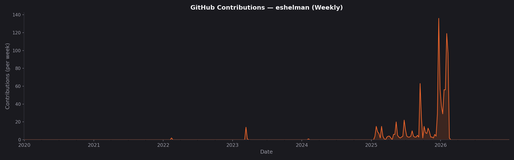
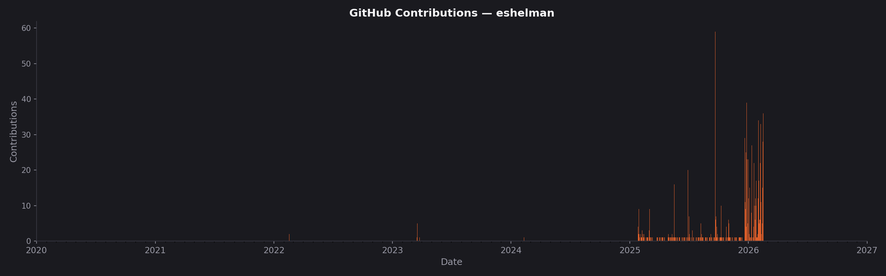
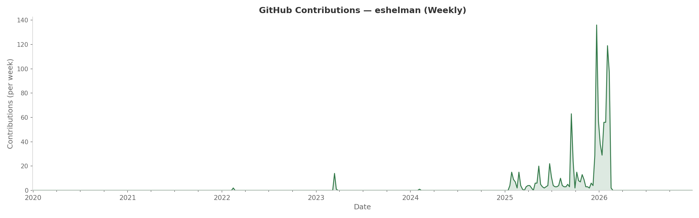
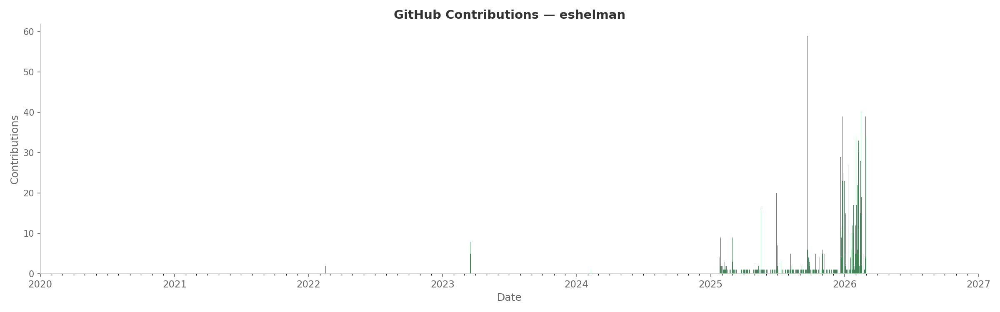

# ExponentialGithub

Tracking and visualizing my GitHub contribution history — which has been growing exponentially.

### 6by9 theme



### Default theme



## Usage

### Fetch contribution data

Requires [GitHub CLI](https://cli.github.com/) (`gh`) and `jq`.

```bash
./fetch_contributions.sh              # defaults: eshelman, 2020–2026
./fetch_contributions.sh <user> <start_year> <end_year>
```

This saves daily contribution counts to `contributions.json`.

### Generate plots

Requires Python 3 and `matplotlib`.

```bash
python3 plot_daily_bar.py                # daily bar chart (default theme)
python3 plot_weekly_line.py              # weekly line graph (default theme)
python3 plot_daily_bar.py --theme 6by9   # daily bar chart (6by9 dark theme)
python3 plot_weekly_line.py --theme 6by9 # weekly line graph (6by9 dark theme)
```
