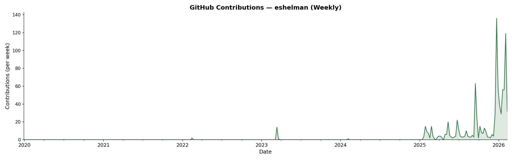
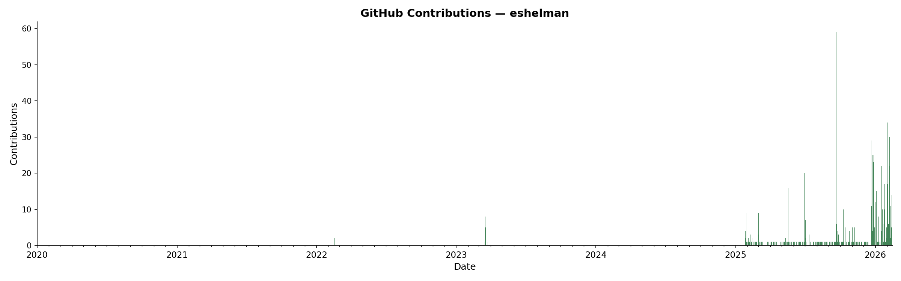

# ExponentialGithub

Tracking and visualizing my GitHub contribution history — which has been growing exponentially.





## Usage

### Fetch contribution data

Requires [GitHub CLI](https://cli.github.com/) (`gh`) and `jq`.

```bash
./fetch_contributions.sh              # defaults: eshelman, 2020–2026
./fetch_contributions.sh <user> <start_year> <end_year>
```

This saves daily contribution counts to `contributions.json`.

### Generate plots

Requires Python 3 and `matplotlib`.

```bash
python3 plot_daily_bar.py     # daily bar chart
python3 plot_weekly_line.py   # weekly line graph
```
